# title：别再到处找笔记软件了，最靠谱的就这个。

 之前写过一篇文章，介绍使用 **Typora + PicGo**，以**腾讯云**作为图床来写文章的方法，在这个工作流中，腾讯云图床是唯一需要付费的，按我目前正在用的 **50 GB/月** 的存储方案，一年下来的价格为 47 元。

这个价格我觉得还可以接受，因此也就没有使用免费的图床，例如国内的码云 Gitee 等。

说到码云，虽然它可以免费存储图片，但免费终究是免费，个人版存在着限制：所有仓库的总容量为 5 GB，如果你上传的图片过多，用完了 5 GB 的免费额度，也就无法再继续使用了。

国内的码云 Gitee，是对标国外的 GitHub 来做的，因为是国内的网站，Gitee 可以无障碍访问，除了这个优点之外，GitHub 在很多方面都是超越 Gitee 的，譬如，**GitHub 个人用户的存储空间是没有限制的，官方建议单个仓库的体积小于 1 GB**，较小的仓库有利于提高克隆速度。

因此，如果你既不想花钱用付费的图床，也不希望受到类似 Gitee 免费图床的限制，那么使用 GitHub 作为图床，可以说是一个非常不错的选择。

今天的这篇文章，我想简单介绍一下，基于 **Typora + Git + GitHub** 来写文章的流程，希望对有需要的朋友有帮助。

## Typora

Typora，是一个简洁、免费的 Markdown 编辑器，支持 Windows、macOS 和 Linux 系统。    

关于 Typora 这个软件本身，这里就不过多介绍，这里主要介绍将文章上传到 GitHub，在 GitHub 中可以正常查看我们添加的图片所需要的设置。  

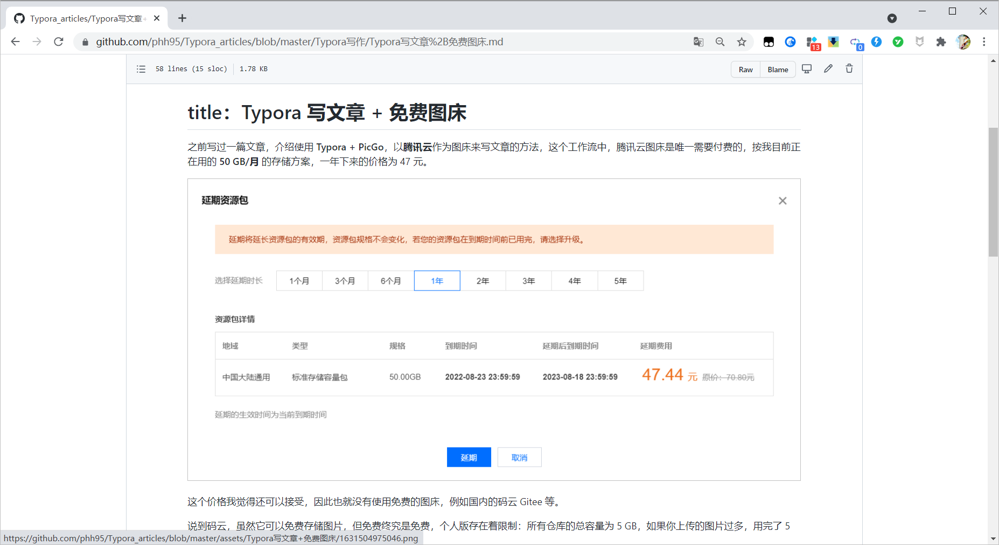

打开 Typora 的设置面板，点击 文件 >> 偏好设置。      

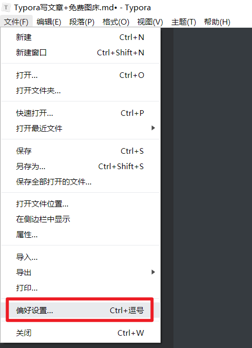

将左侧切换到「图像」选项卡，右侧的第一个选项是一个下拉框，下拉之后选择「**复制到指定路径**」，接着勾选下方的「**优先使用相对路径**」，再接着**设置保存图片的路径**，这里我选择将图片保存在一个名为 assets 的文件夹中。

在路径后面添加 `\${filename}`，会对图片**自动进行归档**，将一篇文章中用到的图片都放到一个文件夹中。      

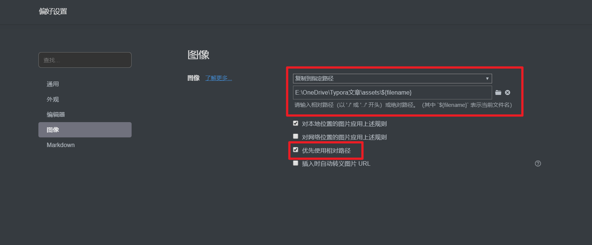

如下图所示，保存图片的路径中添加了 `\${filename}`，它会在文件夹中自动生成一个**以文章标题为名**的子文件夹，这个子文件夹就存放了这篇文章中用到的所有图片。   

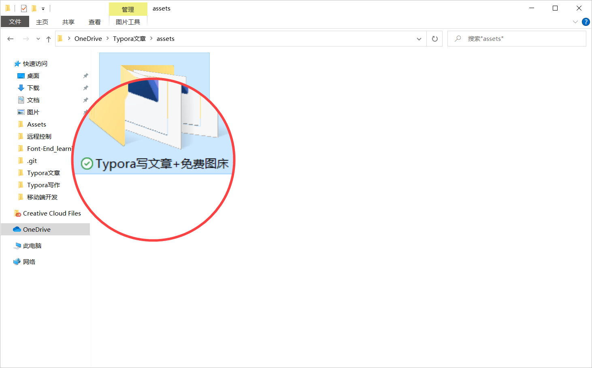

## 下载 Git 

我们想要将本地写的文章或者笔记上传到 GitHub，手动逐个上传文件还是比较麻烦，也不够优雅，这里我们使用一个程序员群体经常会用到的工具——**Git**，来帮我们快速地上传文件。  

Git 支持 Windows、macOS 和 Linux 系统，下载之后，像平常安装软件那样安装 Git 即可。

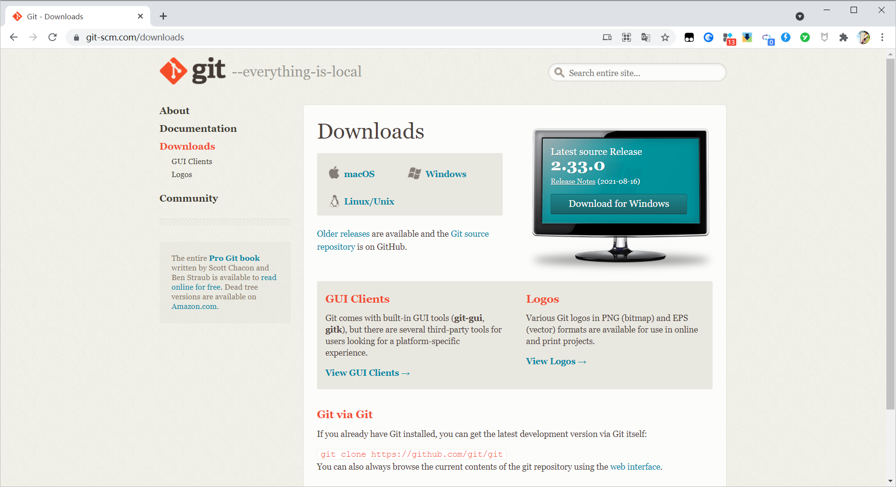

Git 官网下载：

*https://git-scm.com/downloads*

对于使用 Windows 电脑的朋友来说，安装好 Git 之后，还需要多一个步骤——**配置 Git 的环境变量**，因为如果不配置环境变量的话，后面用到的 Git 命令无法正常运行。   

使用 Win + S 打开 Win 10 自带的搜索，搜索「**环境变量**」，点击进入上方返回的「**编辑系统环境变量**」。

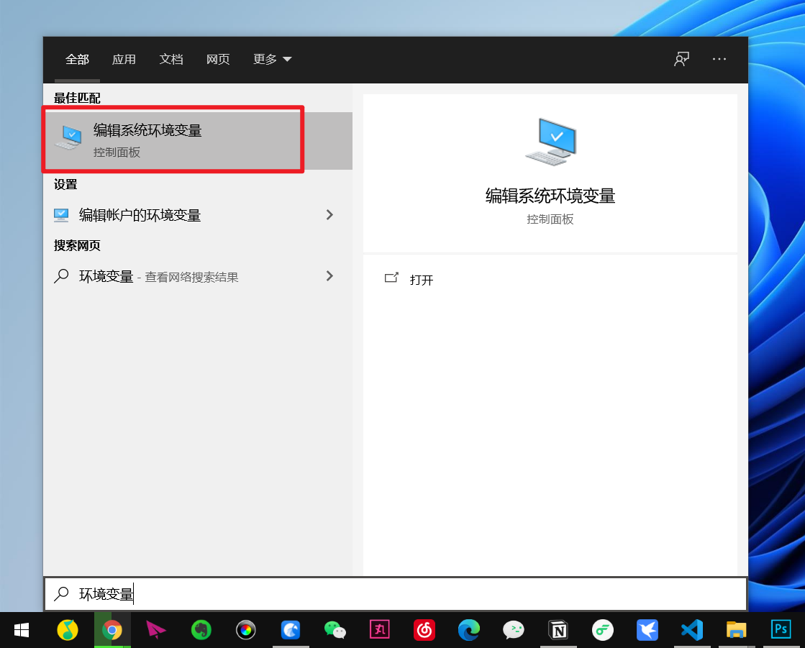

在打开的面板，点击右下角的**环境变量**。

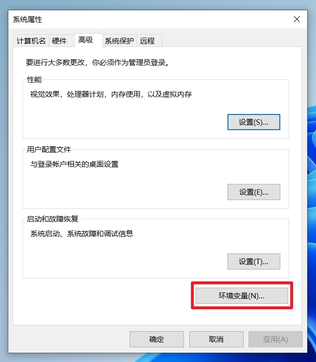

选中下方的「系统变量」中的「Path」，点击右下角的「编辑」。   

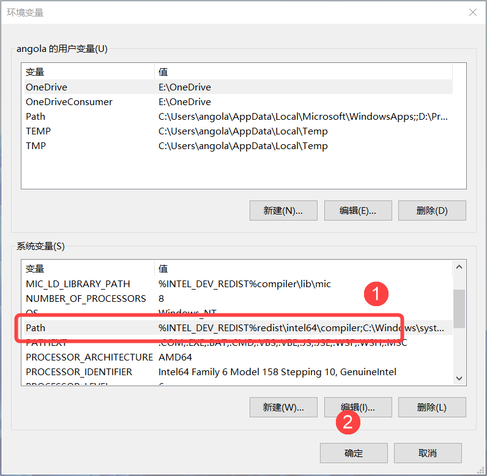

点击右侧的「新建」，最下方会弹出一个让我们输入内容的提示框，这里需要添加的是 **git.exe 的安装路径**。  

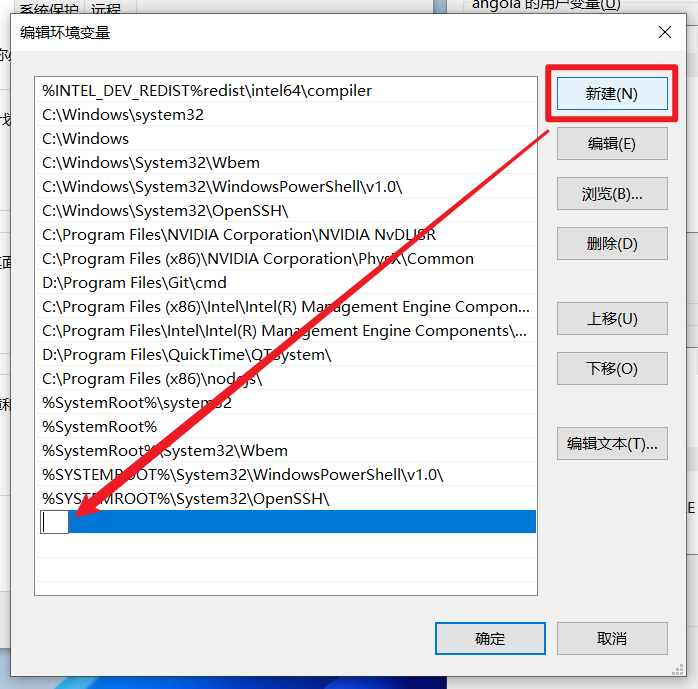

以我为例，我把 Git 安装在了 D 盘，git.exe 的具体路径为 `d:\program files\git\cmd`，进入这个路径，用鼠标选中顶部的路径，按下 Ctrl + C 复制。 

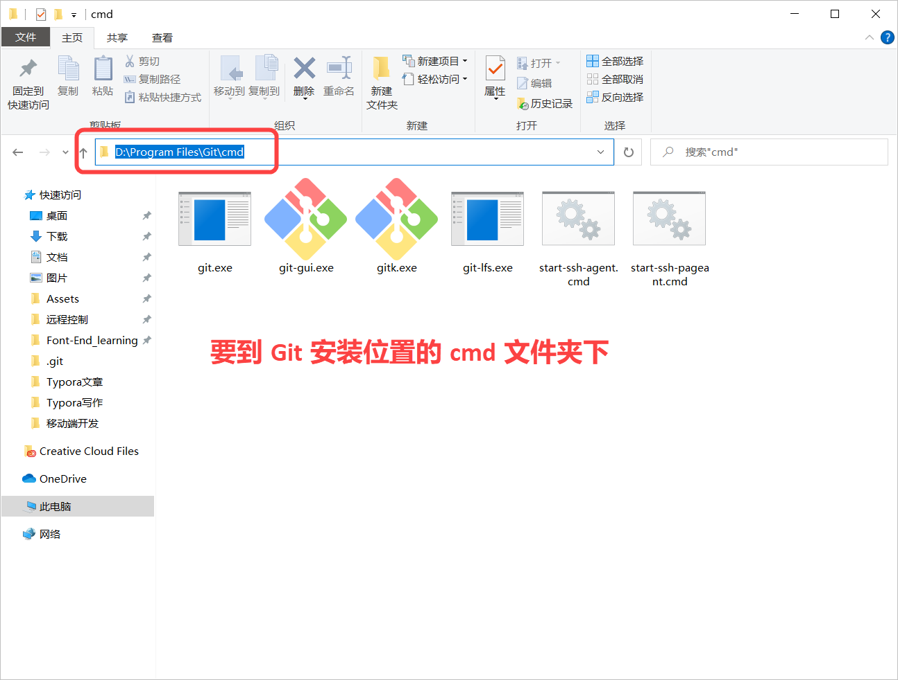

接着粘贴到环境变量的输入框中，鼠标点击空白的区域，确认添加。这样一番操作之后，我们就完成了 Git 环境变量的添加。  

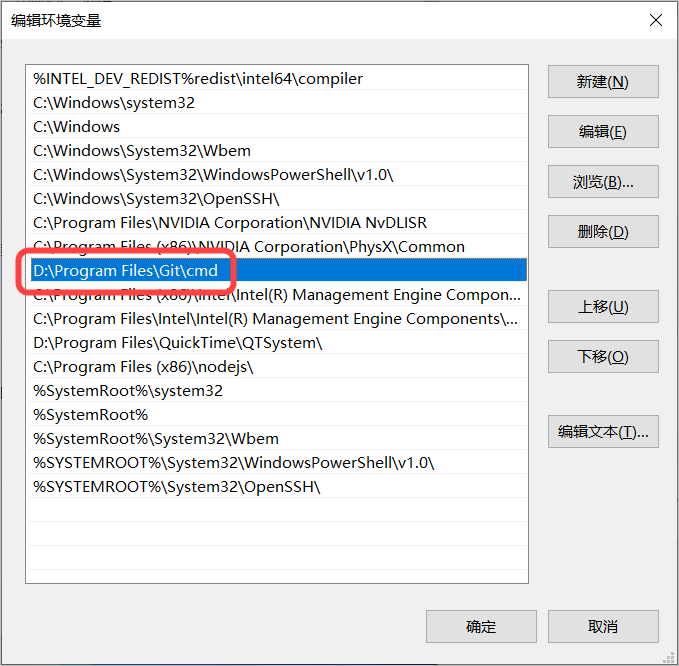

## 配置公钥

将我们电脑本地与远端的 GitHub 仓库连接起来，还需要用到**传输协议**，常用的传输协议如下图，这里我们选择使用 **ssh 协议**。  

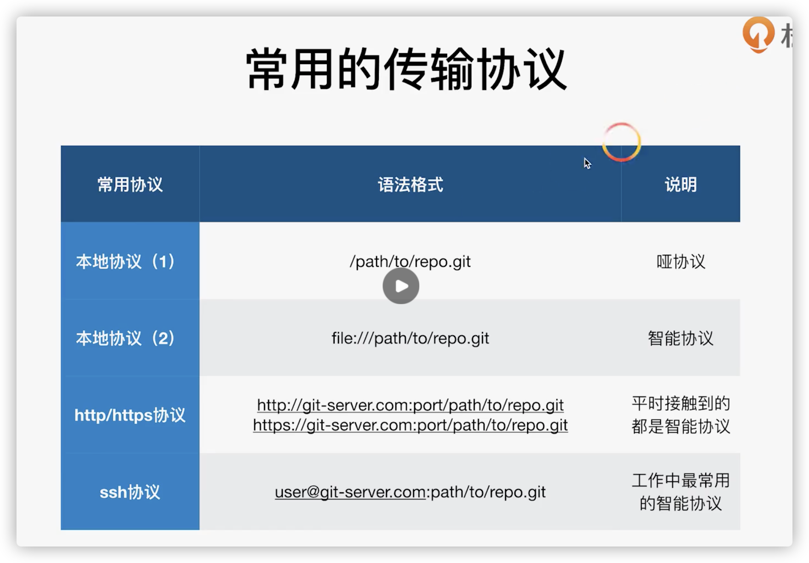

为了简化生成公钥的流程，这里我们可以使用另外一个工具——**Quicker**，Quicker 是一个 Windows 上的多功能工具箱，有点像是苹果生态下的「快捷指令」，通过使用别人写好的**快捷指令**或**动作**，可以让我们免去操作中间的繁琐流程。

安装好 Quicker 之后，我们需要给 Quicker 添加「**获得 ssh 公钥**」的动作，添加动作的方法，可以查看我之前写过的一篇文章：[这款相见恨晚的效率神器，让我卸载了80%的软件](https://mp.weixin.qq.com/s/KRAF8meoK7BsNahb-I3MbA)   

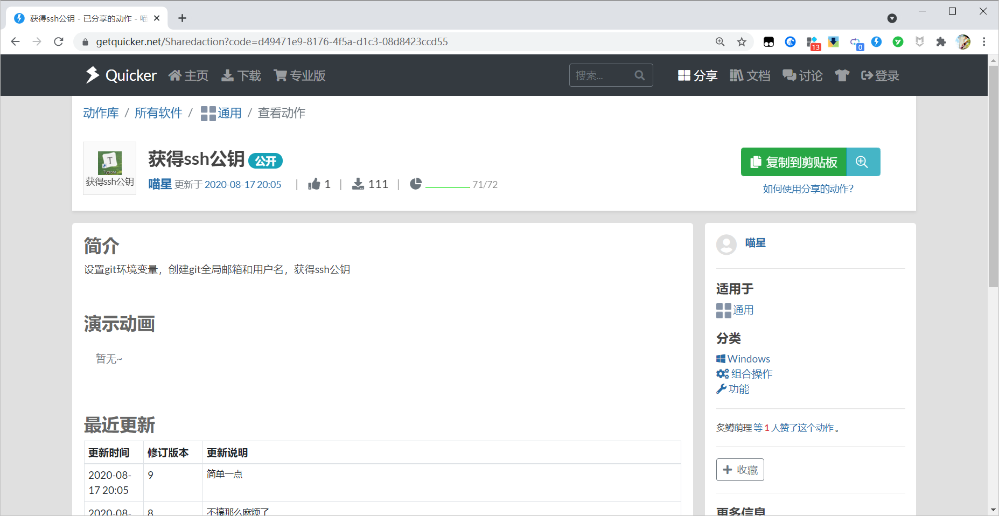

Quicker 动作「获得 ssh 公钥」安装地址：

*https://sourl.cn/vMbu46*  

添加动作之后，按下鼠标中键，呼出 Quicker 面板，点击运行「获得 ssh 公钥」。   

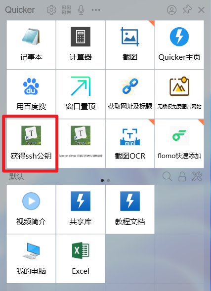

运行后会打开一个 PowerShell 的窗口，窗口提示会生成一对公钥和私钥，按下 Enter 回车键，确认保存公钥和私钥的位置，后面还会提示让我们输入密码，简单起见，就不设置密码了，直接按下回车键即可。

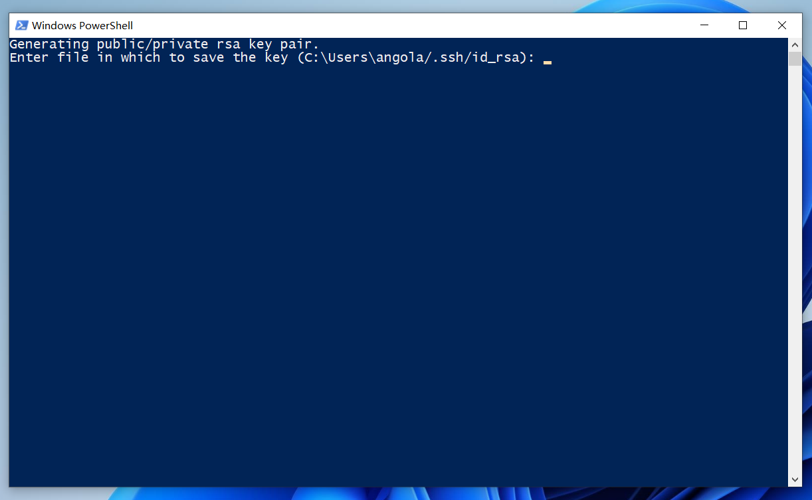

最后它会在窗口中显示生成的公钥，如下图所示的一大坨以 ssh-rsa 开头的内容，用鼠标选中**复制**这一大坨内容。

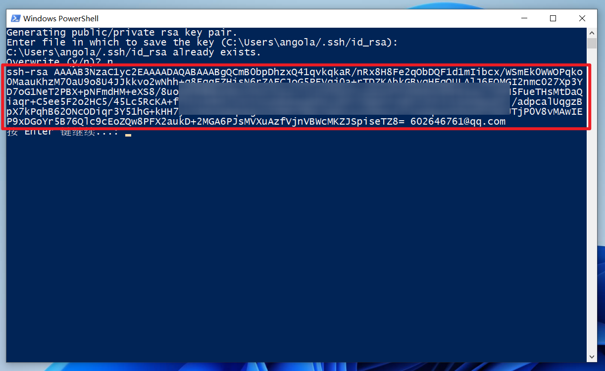

## GitHub  配置公钥 & 创建仓库

得到公钥之后，打开 GitHub 官网，点击右上角的个人头像，选择 Settings 打开设置页面。

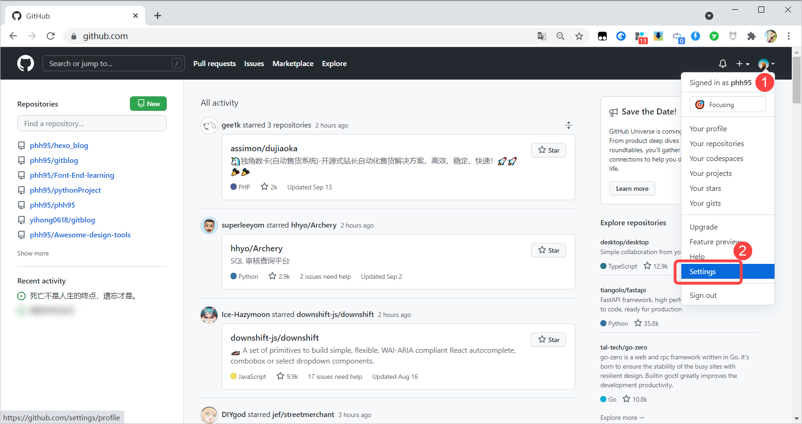

左侧栏切换到 **SSH and GPG keys** 选项卡，点击右上角的 **New SSH key**。

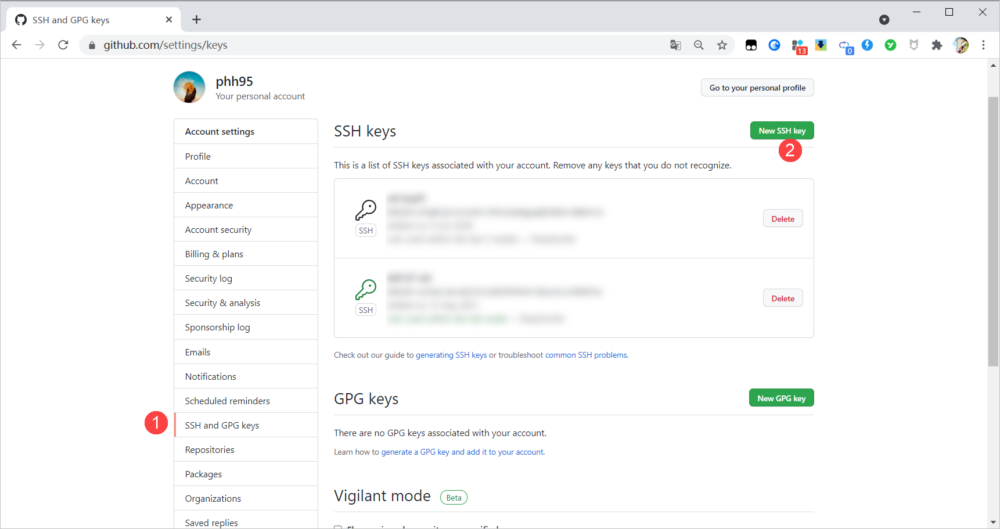

在打开的 SSH 配置页面，**在 Key 里面粘贴从 PowerShell 中复制的公钥**，而上面的 Title 可以随意写，可以写你当前正在使用的电脑名称，例如 dell_g7_ssh。

到这里，我们就完成了本地和 GitHub 仓库传输文件的配置。

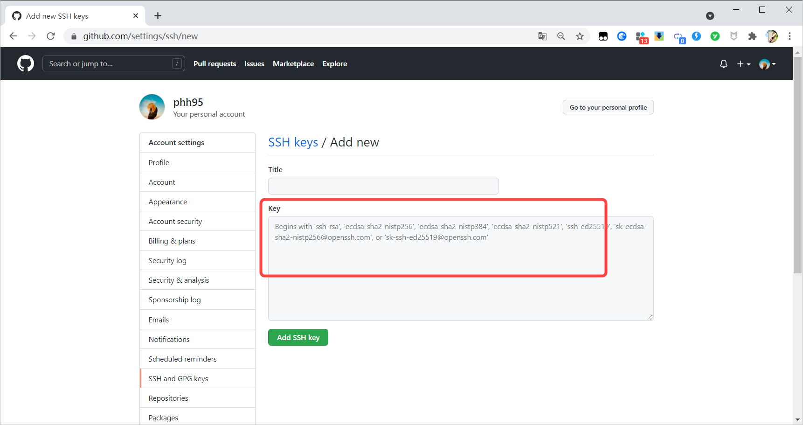

接着我们在 GitHub 中**创建一个新的仓库**，用来存放我们等下要上传到 GitHub 的文章。以我自己为例，我创建一个名为「**Typora_articles**」的仓库，对于刚创建的新仓库，一般会有类似下图的引导。

点击下方的 **SSH** 按钮，获得仓库的 SSH 传输链接，再点击最右侧的像是「记事本」的按钮，将 SSH 链接复制到系统剪切板。 

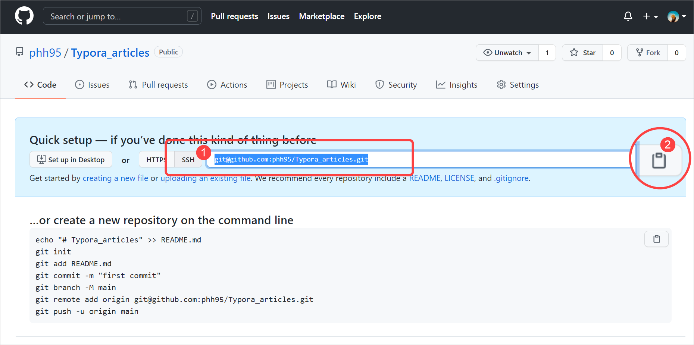

## 本地配置

我们在本地写东西使用的工具是 Typora，它不像微软的 VS Code 代码编辑器那么强大——集成了 Git，可以通过图形化操作的方式，很方便地将本地文件上传到 GitHub。  

为了简化 Typora 往 GitHub 上传文件的操作，我们要再次用到 Quicker，需要给 Quicker 安装另外一个动作「Typora+github 云笔记初始化/远程同步」

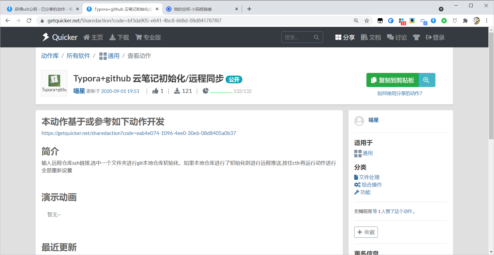

Quicker 动作「Typora+github 云笔记初始化/远程同步」安装地址：

*https://sourl.cn/tLeFKN*

添加动作之后，按下鼠标中键呼出 Quicker 面板，将鼠标移动到刚安装的动作上方，按住 **Ctrl** 键，再单击鼠标左键，会弹出下图右侧的窗口，**粘贴前面创建的 GitHub 仓库的 SSH 链接**。

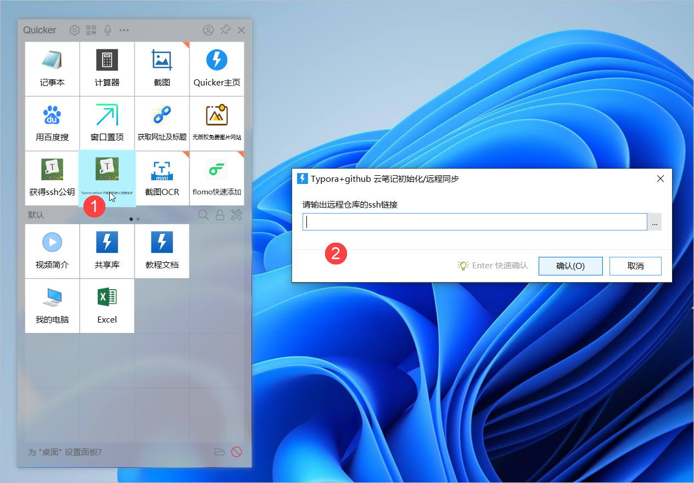

粘贴 SSH 链接之后，会弹出下图的窗口，从本地选择要上传到 GitHub 的文件夹。

由于我将 Typora 的文章存放在

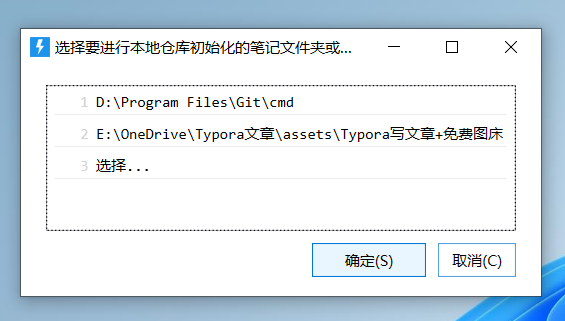

