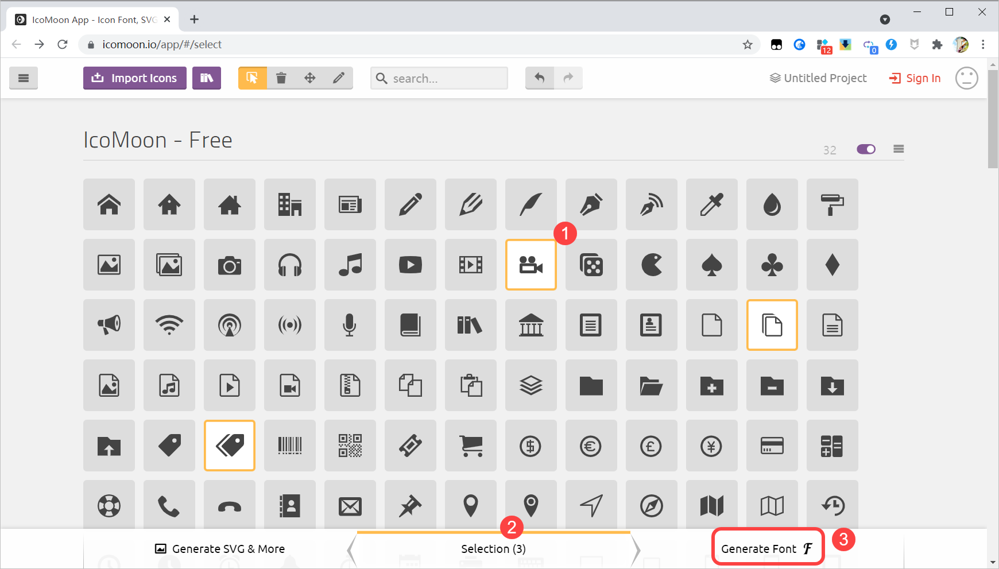
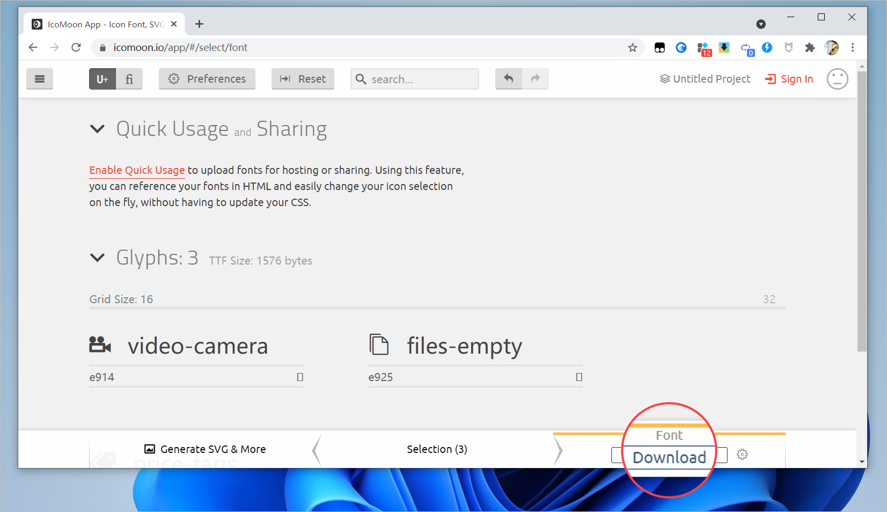

# title：使用 icon 图标

最近在 B 站上看 Pink 老师的前端视频，简单总结一下在网页中使用 icon 图标的两种方法。   

## 直接插入字体图标

这里说的字体图标，是指既有普通 icon 图标的外观，又带有字体特征的图标，可以像调整字体那样、调整图标的大小和颜色，且图标放大之后不会失真变模糊。  

我们一般是从网上下载字体图标的，譬如国内的阿里巴巴旗下的矢量素材网站 **iconfont**、国外的 **IcoMoon** 等。 

去年写过一篇文章《[微信小程序开发 | 如何在小程序中使用自定义 icon 图标](https://mp.weixin.qq.com/s/yxQ4Rrx8r9An2dqreTkndA)》，其中介绍了 iconfont 图标的使用，这回介绍一下使用来自 IcoMoon 的图标的方法。  

打开 IcoMoon 图标官网，从中挑选你想使用的 icon 图标，底部的 Selection 会统计你选中的图标数量，选好图标之后，点击右下角的 **Generate Font**，生成字体图标。  

在打开的页面，会显示我们刚才挑选的所有 icon 图标，并且提供图标的 unicode 编码，这些编码等下要用到，但现在先不管。点击右下角的 **Download**，下载生成的字体图标文件。  

IcoMoon 图标下载：

*https://icomoon.io/app/#/select*

## 通过伪类

