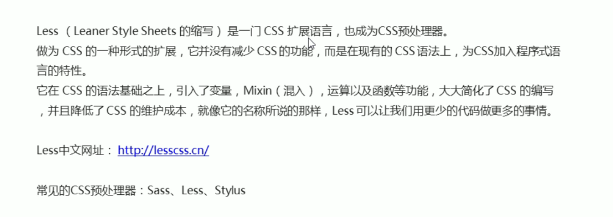
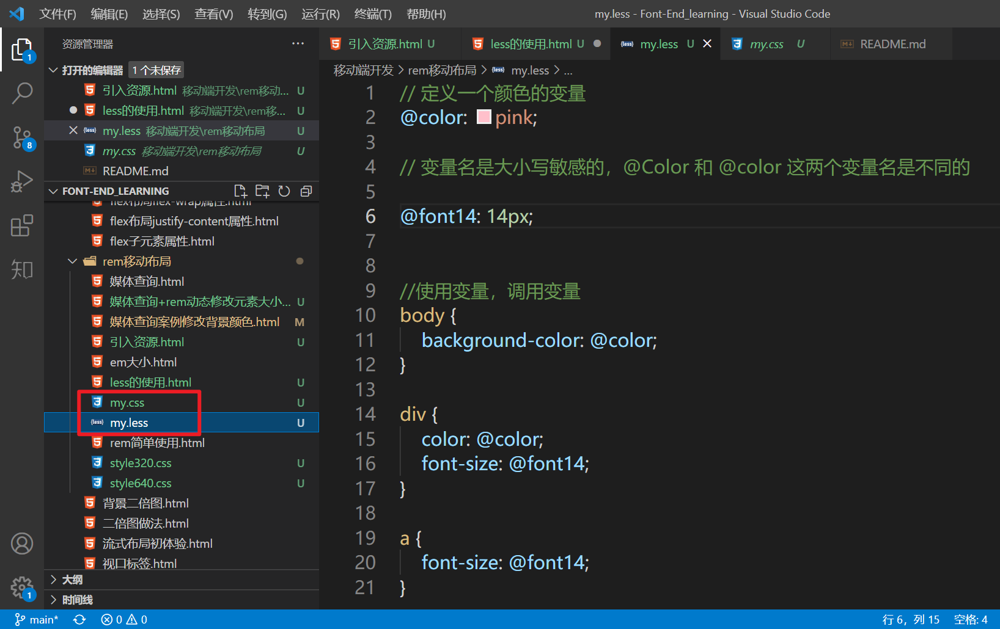

CSS 是一门非程序式语言，没有变量、函数、Scope（作用域）等概念。

维护 CSS 的弊端：

- CSS 需要书写大量看似没有逻辑的代码，冗余度比较高
- 不方便维护及扩展，不利于复用
- CSS 没有很好的计算能力
- 对非前端开发工程师来讲，往往会因为缺少 CSS 等编写经验而很难写出组织良好且易于维护的 CSS 代码项目。

Less 可以很好地解决前面说到的 CSS 弊端和缺点。

Less 是一门 CSS 扩展语言，为 CSS 加入了程序式语言的特性，可以**进行加减乘除运算**。  



### less 的使用

新建一个文件，后缀为 less，在 less 文件中书写 less 语句。

- less 变量
- less 编译
- less 嵌套
- less 运算

变量是指没有固定的值，可以随意改变。CSS 中的颜色和数值就会经常使用 less 变量。

语法：

```css
@变量名: 值；
```

变量命名规范：

- 必须有 @ 为前缀
- 不能包含特殊字符
- 不能以数字开头
- 大小写敏感

### less 编译插件

Less 包含一套自定义的语法及一个解析器，用户根据这些语法定义自己的样式规范，这些规则最终会通过解析器，编译生成对应的 CSS 文件。

因此，需要把 less 文件编译生成 CSS 文件，才可以被 html 引用。

安装一个 VS Code 插件：Easy LESS

安装插件之后，保存一下 less 文件，会自动生成 CSS 文件，如下图所示。  


